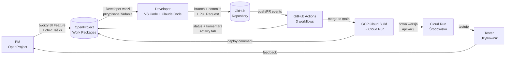
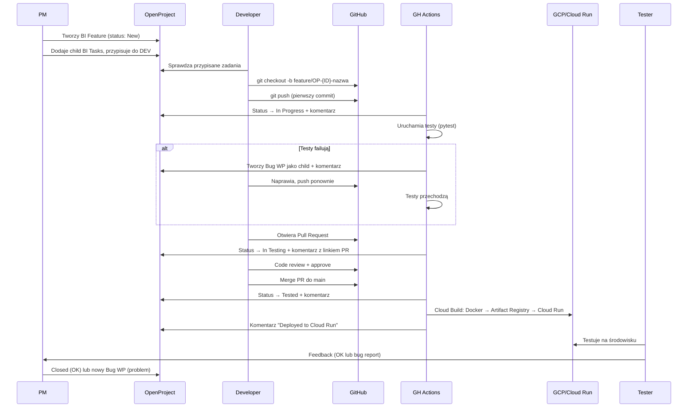
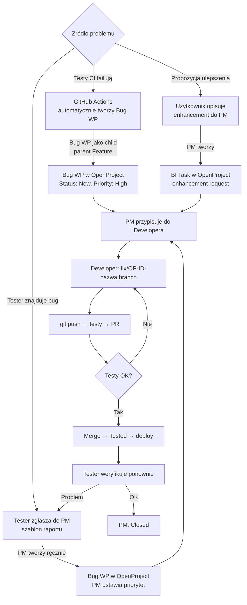

# Przewodnik codziennej pracy z OpenProject + GitHub + GCP

## 1. Przegląd systemu

Cztery komponenty współpracują automatycznie:

| Komponent | Rola | Kto używa |
|---|---|---|
| **OpenProject** | Zarządzanie zadaniami, śledzenie statusów | PM, Developer, Tester |
| **GitHub** | Repozytorium kodu, Pull Requesty | Developer |
| **GitHub Actions** | CI/CD: testy, statusy OP, trigger Cloud Build | Automatycznie |
| **GCP Cloud Build + Cloud Run** | Build Docker, deploy aplikacji | Automatycznie |

### Przepływ danych



### Trzy workflow GitHub Actions

| Workflow | Trigger | Co robi |
|---|---|---|
| `op-status-update.yml` | push na branch `OP-*`, otwarcie/zamknięcie PR | Zmienia status WP + dodaje komentarz w Activity |
| `tests.yml` | push, PR | Uruchamia pytest, tworzy Bug WP przy failure |
| `deploy.yml` | push do main (merge) | Wywołuje Cloud Build → deploy na Cloud Run |

---

## 2. Cykl życia Feature



### Tabela statusów

| Status | ID | Kto zmienia | Kiedy | Jak |
|---|---|---|---|---|
| **New** | 1 | PM (ręcznie) | Tworzenie zadania | OP UI |
| **In Progress** | 7 | Automatycznie | Pierwszy push na branch `OP-*` | GitHub Actions |
| **In Testing** | 9 | Automatycznie | Otwarcie Pull Request | GitHub Actions |
| **Tested** | 10 | Automatycznie | Merge PR do main | GitHub Actions |
| **Rejected** | 14 | Automatycznie | Zamknięcie PR bez merge | GitHub Actions |
| **Closed** | — | PM (ręcznie) | Weryfikacja na środowisku OK | OP UI |

---

## 3. Cykl życia Buga i feedbacku



### Różnice: Bug z CI vs Bug od użytkownika

| Cecha | Bug z CI (automatyczny) | Bug od użytkownika |
|---|---|---|
| Kto tworzy WP | GitHub Actions (automatycznie) | PM (ręcznie) |
| Typ | Bug (ID 7) | Bug (ID 7) lub BI Task |
| Priorytet | High (ID 9) | PM decyduje |
| Parent | Automatycznie: OP-{ID} z brancha | PM ustawia ręcznie |
| Opis | Link do CI run + liczba failów | Szablon raportu od testera |
| Branch | `fix/OP-{BUG_ID}-opis` | `fix/OP-{BUG_ID}-opis` |

---

## 4. Rola: Product Manager

> Szczegółowa codzienna lista: [checklists/pm-daily-checklist.md](checklists/pm-daily-checklist.md)

### Kluczowe zasady

1. **OpenProject jest nadzorcą** — tu zarządzasz strukturą, priorytetami, przypisaniami
2. **Nie pytaj developerów o status** — sprawdź Activity tab, github-bot pisze komentarze automatycznie
3. **Jedyna ręczna zmiana statusu** to `Tested → Closed` po weryfikacji na środowisku
4. **Kryteria akceptacji w checkboxach** — developer (i Claude Code) przeczyta je i na tej podstawie napisze kod + testy

### Jak tworzyć dobre BI Feature

```markdown
Subject: Logowanie przez Google OAuth2

## Opis
Użytkownicy powinni móc logować się przez konto Google oprócz
standardowego loginu/hasła.

## Kryteria akceptacji
- [ ] Przycisk "Zaloguj przez Google" na stronie logowania
- [ ] Po kliknięciu redirect do Google OAuth2
- [ ] Po autoryzacji użytkownik jest zalogowany i przekierowany do dashboardu
- [ ] Nowy użytkownik Google jest automatycznie tworzony w systemie
- [ ] Endpoint /api/auth/google zwraca JWT token
- [ ] Test integracyjny pokrywa pełny flow OAuth2
```

### Komentarze github-bot w Activity

Gdy developer pracuje, w Activity zobaczysz komentarze:

- **"Commit pushed"** — developer zaczął pracę, z linkiem do commita i opisem zmian
- **"Pull Request opened"** — kod gotowy do review, z linkiem do PR
- **"Pull Request merged"** — kod zaakceptowany i wdrożony
- **"Deployed to Cloud Run"** — nowa wersja działa na środowisku
- **"Automated Bug created"** — testy wykryły problem, stworzono Bug WP

---

## 5. Rola: Developer

> Szczegółowa codzienna lista: [checklists/developer-daily-checklist.md](checklists/developer-daily-checklist.md)

### Konfiguracja środowiska

Każdy developer w zespole powinien mieć:

1. **VS Code** z ustawieniami z repozytorium (`.vscode/settings.json` — ruff, format on save)
2. **Claude Code** zainstalowany (`npm install -g @anthropic-ai/claude-code`)
3. **GitHub CLI** (`gh`) do tworzenia PR z terminala
4. **Python 3.12** + virtual environment

### CLAUDE.md — standard zespołowy

Plik `CLAUDE.md` w repozytorium jest czytany automatycznie przez Claude Code. Zawiera:
- Konwencje branchów i commitów
- ID statusów i typów OpenProject API
- Szablon PR
- Zasady kodowania (pytest, ruff, type hints)

**Nie modyfikuj CLAUDE.md lokalnie** — jest wspólny dla zespołu i commitowany do repo.

### Git workflow krok po kroku

```
1. Sprawdź zadania w OP              → OP-{ID}
2. git checkout -b feature/OP-{ID}-nazwa
3. Koduj (z Claude Code lub samodzielnie)
4. pytest --tb=short && ruff check .
5. git add . && git commit -m "feat(OP-{ID}): opis"
6. git push -u origin feature/OP-{ID}-nazwa
   → Automatycznie: status In Progress + komentarz
   → Automatycznie: testy CI
7. gh pr create --fill
   → Automatycznie: status In Testing + komentarz
8. Code review + merge
   → Automatycznie: status Tested + deploy
```

### Praca z Claude Code — przykłady

```bash
# Uruchom Claude Code w katalogu projektu
claude

# Przykładowe prompty:
"Pracuję nad OP-42. Przeczytaj kryteria akceptacji i zaimplementuj"
"Napisz testy pytest dla OP-42 pokrywające wszystkie checkboxy"
"Stwórz commit z opisem zmian dla OP-42"
"Otwórz PR dla OP-42 używając szablonu z repo"
"Testy failują w test_oauth.py — napraw błąd"
```

Claude Code automatycznie:
- Formatuje commity jako `feat(OP-42): opis`
- Używa szablonu PR z `.github/PULL_REQUEST_TEMPLATE.md`
- Wie o konwencjach branchów i nie commituje do main
- Zna stack (Python, FastAPI, pytest)

---

## 6. Rola: Tester / Użytkownik

> Szczegółowa codzienna lista: [checklists/tester-daily-checklist.md](checklists/tester-daily-checklist.md)

### Kiedy testować

Feature jest gotowa do testów gdy status w OP = **Tested** i w Activity jest komentarz **"Deployed to Cloud Run"**.

### Gdzie testować

- URL środowiska: `https://my-service-drcdgcyjda-lm.a.run.app`
- Health check: `https://my-service-drcdgcyjda-lm.a.run.app/health`

### Jak raportować

| Sytuacja | Akcja | Kto dalej |
|---|---|---|
| Wszystko OK | Komentarz w OP Activity: "Zweryfikowano, OK" | PM zmienia na Closed |
| Znaleziono bug | Wyślij raport do PM (szablon w checkliście) | PM tworzy Bug WP |
| Propozycja zmiany | Opisz PM co i dlaczego | PM tworzy BI Task |

### Cykl: zgłoszenie → poprawka → weryfikacja

```
Tester → PM (raport) → Bug WP w OP → Developer → fix branch →
push → testy CI → PR → merge → deploy → Tester weryfikuje ponownie
```

Cały cykl od zgłoszenia do nowej wersji na środowisku trwa typowo **kilka godzin**, nie dni — dzięki pełnej automatyzacji CI/CD.

---

## 7. Tabela referencyjna

### Statusy OpenProject

| ID | Status | Ustawiany przez | Kiedy |
|---|---|---|---|
| 1 | New | PM / GitHub Actions | Tworzenie WP / Bug z CI |
| 7 | In Progress | GitHub Actions | Pierwszy push na branch `OP-*` |
| 9 | In Testing | GitHub Actions | Otwarcie Pull Request |
| 10 | Tested | GitHub Actions | Merge PR do main |
| 14 | Rejected | GitHub Actions | Zamknięcie PR bez merge |
| — | Closed | PM (ręcznie) | Weryfikacja na środowisku OK |

### Wzorce branchów

| Wzorzec | Użycie | Przykład |
|---|---|---|
| `feature/OP-{ID}-nazwa` | BI Feature | `feature/OP-42-google-oauth` |
| `task/OP-{ID}-nazwa` | BI Task | `task/OP-87-implement-oauth2` |
| `fix/OP-{ID}-nazwa` | Bug fix | `fix/OP-103-token-expiry` |

### Wzorce commitów

| Wzorzec | Użycie |
|---|---|
| `feat(OP-{ID}): opis` | Nowa funkcjonalność |
| `fix(OP-{ID}): opis` | Poprawka błędu |
| `task(OP-{ID}): opis` | Zadanie techniczne |

### Kluczowe URL-e

| Zasób | URL |
|---|---|
| OpenProject | `https://aidevs4seba2.openproject.com` |
| GitHub Repo | `https://github.com/SebastianS78-create/OPIntegration` |
| Cloud Run | `https://my-service-drcdgcyjda-lm.a.run.app` |
| Cloud Console (Build) | `https://console.cloud.google.com/cloud-build/builds?project=opintegr` |
| Cloud Console (Run) | `https://console.cloud.google.com/run?project=opintegr` |

---

## 8. FAQ / Troubleshooting

### "Status się nie zmienił po push"

- Sprawdź czy nazwa brancha zawiera `OP-{ID}` (np. `feature/OP-42-nazwa`)
- Sprawdź GitHub Actions → czy workflow `op-status-update.yml` się uruchomił
- Sprawdź czy workflow transitions są skonfigurowane w OP Administration → Workflows

### "Bug WP się nie stworzył po failure testów"

- Sprawdź czy typ **Bug** jest włączony w Project Settings → Types
- Sprawdź czy `OPENPROJECT_PROJECT_ID` w GitHub Secrets jest poprawny
- Sprawdź logi workflow `tests.yml` w GitHub Actions

### "Deploy nie poszedł"

- Sprawdź GitHub Actions → workflow `deploy.yml` → krok "Submit build to Cloud Build"
- Sprawdź Cloud Console → Cloud Build → logi buildu
- Najczęstsze przyczyny: brak uprawnień SA, błąd w Dockerfile, błąd w kodzie

### "Komentarz nie pojawił się w OP Activity"

- Sprawdź czy `OPENPROJECT_API_TOKEN` jest ważny
- Sprawdź czy `OPENPROJECT_URL` nie ma trailing slash
- Sprawdź logi kroku "Add comment to OpenProject" w GitHub Actions

---

## Dokumentacja techniczna

Pełna konfiguracja systemu (setup, secrets, GCP, WIF): [OpenProject_GitHub_GCP_Config_Guide.md](OpenProject_GitHub_GCP_Config_Guide.md)
